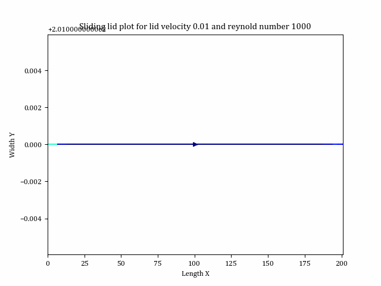

# LatticeBoltzmannSimulation
This project is developed for a course named - "High Performance Computing: Fluid Dynamics with Python" at University of Freiburg

[][MPI]

# Experiments:
1. Shear wave decay (Density and Velocity simulations)
    -> Density : We provide a sinusoidal density initialization along y direction and observe the density decay along time. We also observe the kinematic viscosity variations with omega (relaxation)
    -> Velocity : We provide a sinusoidal velocity initialization and obsrve the density decay with time.
    
     
2. Couette Flow
    -> Couette flow means a hollow channel with upper lid/wall moving with a lid velocity while the bottom one being fixed. We here observe the flow of fluid inside the channel and how it meets the analytical expectations. 
    
    
3. Poiseuille Flow
    -> Poiseuille flow is triggered by the pressure gradient along x direction (Inlet higher and outlet lower) and we here provide a small pressure difference along inlet outlet to observe the flow. Fortunately, here as well we have an analytical solution to match our simulation results with. 
    
    
4. Sliding Lid
    -> Sliding lid has a part of couette flow feature where we have the top wall moving ith right and left wall providing periodic bouceback. The bottom wall is rigid as well. 
    
    

# Directory Info
.
├── init.py
├── lbm_common                      # lbm common files
│   ├── boundary.py 
│   ├── constant.py 
│   ├── lbm.py 
├── simulattions                    # all files and folders regarding simulation and milestones
│   ├── plots                       # results of MPI code. Generated from codeplot.py
│   ├── sliding_lid_mpi             # MPI folder. Contains a standalone MPI running folder. 
│       ├── data                    
│       ├── jobFile.job             
│       ├── sliding_lid_mpi.py      
│   ├── codeplot.py                 # code for running the `.npy` plots output of BwUniCluster
│   ├── couette_flow.py             # Couette
│   ├── poiseuilleFlow.py           # Poiseuille
│   ├── shear_wave.py               # Shear Wave
│   └── sliding_lid.py              # Sliding Lid
└── ...

# Setup:
## Required libraries
    1. Numpy
    2. Matplotlib
    3. Scipy

## Entry point
    init.py                         # serialized
    sliding_lid_mpi.py                         # parallel

