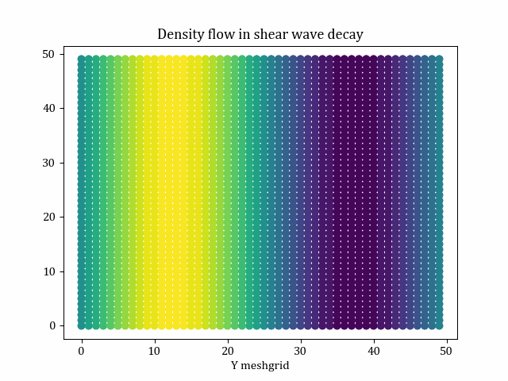
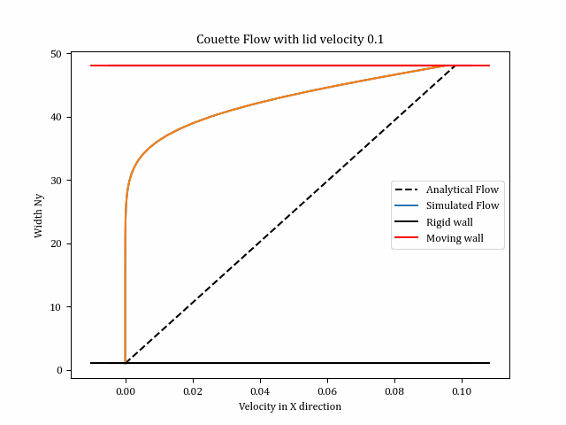
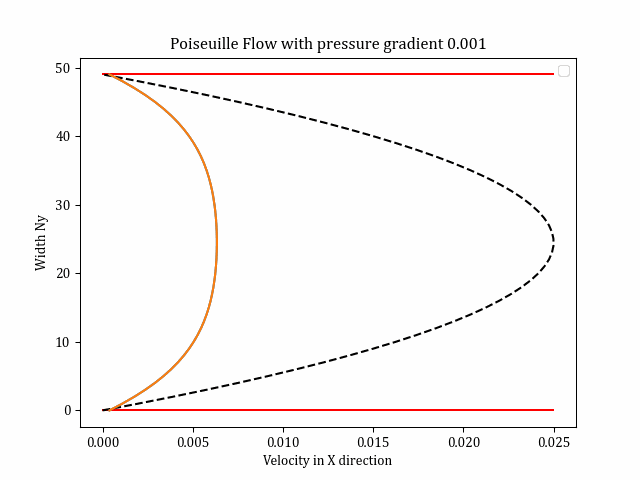
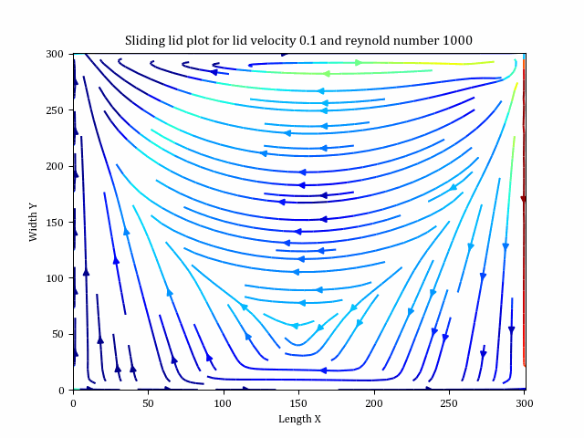
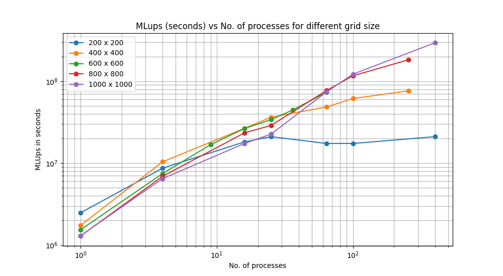

# LatticeBoltzmannSimulation
This project is developed for a course named - "High Performance Computing: Fluid Dynamics with Python" at University of Freiburg. Python packages that's being used and considered as a required installation are [Numpy](https://numpy.org/), [Matplotlib](https://matplotlib.org/). Here, we have developed simulations for 5 fludic problems - Shear wave decay of fluid, Couette, Poiseuille flow and a sliding lid. Also, the sliding lid has been implemented parallely using [BwUniCluster](https://wiki.bwhpc.de/e/). To accomplish this course successfully, I cordially thank [IMTEK Simulation Department](https://www.imtek.uni-freiburg.de/professuren/simulation/simulation) to guide through the path. 


[Report - High Performance Computing - Computational Fluid dynamics with Python](https://github.com/Dwaipayan-R-C/LatticeBoltzmannSimulation/tree/main/results/Report) 

## Folder Structure
    .
    ├── lbm_common                          # All common files 
    ├── results                             # All simulation results saved
    ├── simulattions                        # Experiment files
    │   ├── plots                           # MPI Plot
    │   ├── sliding_lid_mpi                 # MPI Sliding Lid code
    │   |   ├── data                        # MPI data
    │   |   ├── jobfile.job                 # Batch file to run in cluster
    │   |   ├── sliding_lid_mpi.py          # MPI Sliding lid code
    │   |   └── ...                                
    │   └── ...                                    
    ├── init.py                             # init file to run serialized simulaations
    └── ...     


## Experiments:
1. Shear wave decay (Density and Velocity simulations)
    -> Density : We provide a sinusoidal density initialization along y direction and observe the density decay along time. We also observe the kinematic viscosity variations with omega (relaxation)
    -> Velocity : We provide a sinusoidal velocity initialization and obsrve the density decay with time.
    
     
2. Couette Flow
    -> Couette flow means a hollow channel with upper lid/wall moving with a lid velocity while the bottom one being fixed. We here observe the flow of fluid inside the channel and how it meets the analytical expectations. 
    
    
3. Poiseuille Flow
    -> Poiseuille flow is triggered by the pressure gradient along x direction (Inlet higher and outlet lower) and we here provide a small pressure difference along inlet outlet to observe the flow. Fortunately, here as well we have an analytical solution to match our simulation results with. 
    
    
4. Sliding Lid
    -> Sliding lid has a part of couette flow feature where we have the top wall moving ith right and left wall providing periodic bouceback. The bottom wall is rigid as well. 
    
    
    
    
    

## Entry point
```
init.py                         
jobfile_multiple.job     
```                    

